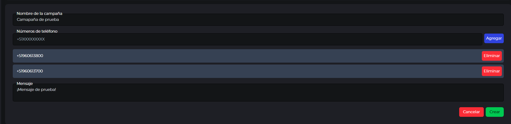
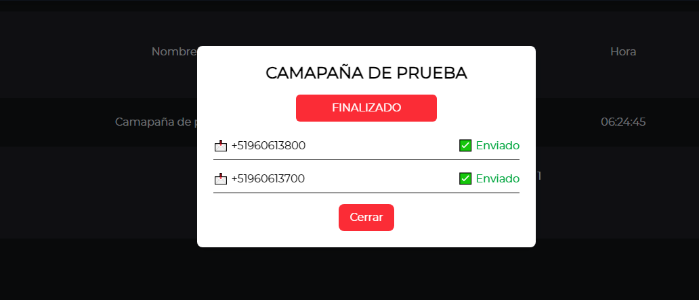

# Proyecto - Backend (Serverless) y Frontend (Angular)

Este proyecto consta de dos componentes principales:

1. **Backend**: API construida con **Node.js** y **Serverless Framework V4**, que se conecta a **AWS Lambda** y otros servicios de **AWS**.
2. **Frontend**: Aplicación de cliente construida con **Angular 19**, que consume la API del backend para interactuar con los datos.

---

## Despliegue en Producción

### DOCUMENTACION

El archivo se enceuntra dentro de  la carpeta  aws-serverless-sinapsis / src / docs / openapi.yaml

- **URL de la documentacion en produccion (API)**: [https://z4x8yt1lic.execute-api.us-east-2.amazonaws.com/api-docs/%7Bproxy+%7D](https://z4x8yt1lic.execute-api.us-east-2.amazonaws.com/api-docs/%7Bproxy+%7D)


### Backend

El backend fue desplegado en **AWS** utilizando **Serverless Framework**. La API está disponible a través de la siguiente URL pública:

- **URL del Backend (API)**: [https://z4x8yt1lic.execute-api.us-east-2.amazonaws.com](https://z4x8yt1lic.execute-api.us-east-2.amazonaws.com)

Esta URL proporciona acceso a las rutas y servicios definidos en la API. En producción, la API gestiona las solicitudes del frontend y se comunica con la base de datos MySQL y otros servicios de AWS.

### Frontend

La aplicación frontend fue desplegada en un servidor web externo. El frontend se comunica con la API de AWS para obtener y mostrar los datos al usuario. Puedes acceder a la aplicación en la siguiente URL:

- **URL del Frontend**: [https://sinapsis.hostbacon.lat/](https://sinapsis.hostbacon.lat/)

---
USUARIO: jhmio
CONTRASEÑA: jhmio


## Instalación y Ejecución del Backend Localmente

Antes de ejecutar el proyecto, asegúrate de tener configurados los siguientes aspectos:

### 1. **Base de Datos**:

- Asegúrate de tener una base de datos llamada `sinapsis` en **MySQL**. Si aún no la tienes, puedes crearla utilizando las credenciales que se encuentran en el archivo `.env`.
- Si aún no tienes la base de datos configurada, ejecuta el siguiente comando en tu terminal de **MySQL** para crearla (si no lo has hecho ya):

  ```sql
  CREATE DATABASE sinapsis;
  ```

- **Nota**: Si usas otro sistema de gestión de base de datos o tienes configuraciones diferentes, asegúrate de ajustar los valores en el archivo `.env` más adelante.

### 2. **Configuración del Archivo `.env`**:

- Dentro de la carpeta `aws-serverless-sinapsis`, donde se encuentra el backend, encontrarás un archivo llamado `.env`. Este archivo contiene las variables de entorno necesarias para conectar el backend a la base de datos y otros servicios.
- Abre el archivo `.env` y modifica las siguientes líneas para ajustarlas a tus credenciales y entorno:

  ```bash
  DB_HOST=<tu-host-de-base-de-datos>    # Ejemplo: localhost o IP de tu servidor de base de datos
  DB_USER=<tu-usuario-de-base-de-datos> # Ejemplo: root
  DB_PASSWORD=<tu-contraseña-de-base-de-datos> # Ejemplo: root
  DB_NAME=sinapsis
  ```

  Asegúrate de que los valores para `DB_HOST`, `DB_USER` y `DB_PASSWORD` coincidan con la configuración de tu base de datos MySQL.

### 3. **Instalar las dependencias**:

Una vez configurada la base de datos y las variables de entorno, instala las dependencias necesarias para el backend. Ejecuta el siguiente comando en tu terminal dentro de la carpeta de backend:

```bash
npm install
```

### 3. **INSERTAR TABLAS DENTRO DE LA BASE DE DATOS**:

- LA PRIMERA OPCION ES IMPORTAR LA BASE DE DATOS QUE ESTA EN EL DIRECTORIO DE ESTE REPOSITORIO LLAMDA **BDSINAPSIS.SQL** O EJECUTAR EL COMANDO DEL SIGUIENTE PUNTO.

- TENGO UNA MIGRACION LISTA PARA INTEGRAR LAS TABLAS DENTRO DE LA BASE DE DATOS EJECUTANDO EL SIGUIENTE COMANDO

```bash
npx knex migrate:latest --knexfile src/config/knexfile.js --env development
```

### 5. **Ejecutar Serverless Localmente**:

Después de haber instalado las dependencias, debes ejecutar el siguiente comando para iniciar el backend de manera local usando Serverless Framework con el plugin serverless-offline:

```bash
serverless offline
```

- Este comando simula el entorno de AWS localmente, permitiéndote probar las funciones de AWS Lambda y otros servicios directamente en tu máquina.
- Al ejecutar serverless offline, verás un mensaje en la consola similar al siguiente:

```bash
Server ready: http://localhost:3000 🚀
```

Es necesario que corra en el puerto 3000, en caso de tener otro puerto es necesario modificar el puerto dentro del frontent en la siguiente ruta frontend-angular / src / environments / environment.ts dentro tendremos la variable apiUrl aqui cambiariamos el puerto dentro de la url.

## Instalación y Ejecución del FRANTED Localmente

### 1. **Instalar las dependencias**:

- Ingresamos a la carpeta `frontend-angular`, donde se encuentra el frontend

- Ejecuta el siguiente comando en la terminal para instalar las dependencias:

```bash
npm install
```

### 2. **Ejecutar ANGULAR Localmente**:

Después de haber instalado las dependencias, debes ejecutar el siguiente comando para iniciar angular de manera local:

```bash
ng serve
```

- Al ejecutar, verás un mensaje en la consola similar al siguiente:

```bash
Local:   http://localhost:4200/
```

Es necesito que corra en el puerto 4200 ya que los cors estan configurados para que acepte este puerto.

### 2. **INGRESAR AL SISTEMA**:

- Desarrolle un formulario de registro y login.

- **URL DEL FORMUALRIO DE REGISTRO**: [http://localhost:4200/register](http://localhost:4200/register)

Aqui solo colocamos nombres y un usario.

Procedemos a registrarlos, si todo esta bien deberia redirigirnos al login.

- **URL PARA EL INICIO DE SESION**: [http://localhost:4200](http://localhost:4200/)

- PARA INGRESAR DEBEMOS COLOCAR NUESTRO USUARIO COMO USUARIO Y CONTRASEÑA.

Datos de prueba.


- PROCEDEREMOS A INGRESAR A LA INTEFAZ GRAFICA DEL SISTEMA.

- NOS LISTARA DE MANERA AUTOMATICA LAS CAMPAÑAS CREADAS.
- TAMBIEN CONTAREMOS CON UN FILTRO POR FECHA DE INICIO Y FECHA FIN.
- PARA EL REGISTRO DE CAMPAÑAS CONTAREMOS CON EL BOTON DE REGISTRO COMO EN LA SIGUIENTE IMAGEN.



- LUEGO DE REGISTRARNOS NOS MOSTRARA EL REGISTRO QUE ACABAMOS DE REALIZAR.


- EN LA COLUMNA DE OPCIONES TENDREMOS UN ICONO AL DARLE CLICK NOS MOSTRARA UN DESPLEGABLE. DESDE AQUI PODEMOS REALIZAR EL ENVIO DE LA CAMPAÑA.



- LUEGO DE CREAR LA CAMPAÑA VOLVEREMOS A LA COLUMNA DE OPCIONES.


- COMO YA ESTA CON ESTADO FINALIZADO NOS PERMITE VISUALIZAR LOS MENSAJES. ADEMAS SE NOS DESABILITA LA OPCION DE ENVIO YA QUE LA CAMAPAÑA FUE CULMINADA.

